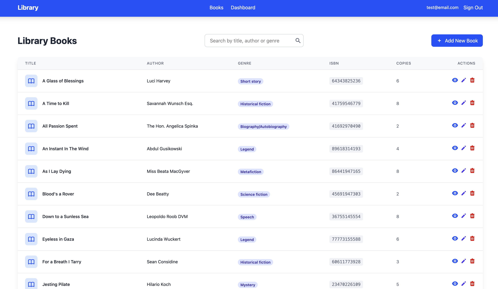
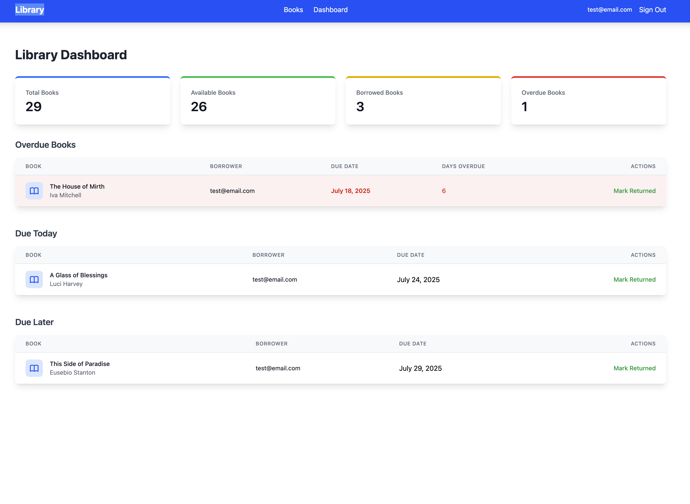
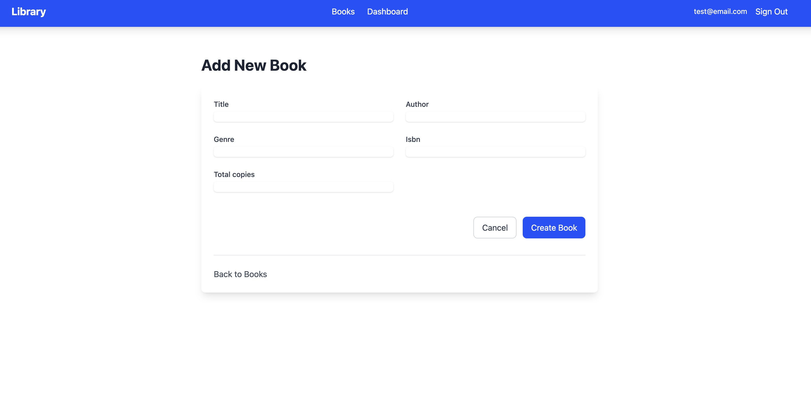

# Users and password

For an easier testing, the seed file creates two a member user and a librarian user.

Ensure the seed file is run with `rails db:seed` to create these users.

For the member user, login with `email: member@email.com` and `password: test123`.

For the librarian user, login with `email: librarian@email.com` and `password: test123`.

# Example of the interface

## List of Books

## Dashboard

## Creating a Book

# Decision log and thought process

I used Devise instead of using the built-in authentication system in Rails
because Devise provides good sign-up and login pages, which saved me some time.

Pundit is a good choice for authorization because it allows for
fine-grained control over user permissions. Also makes it easy for us to
go and look at the policies to see what each user can do.

Available copies of a book: Initially I created an available_copies column in
the books table, but later I realized that keeping it updated could be a problem.
So I decided to create a method that calculates the number of available copies
on the fly. I'm still not happy with this solution, but it works for now.

I added TailwindCSS because it makes it easy to style the application
and provides a good set of utility classes to work with. I just wanted a quick
way to style the application without having to write a lot of custom CSS.